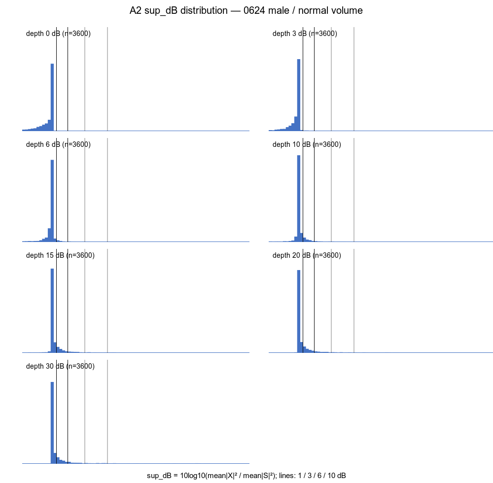
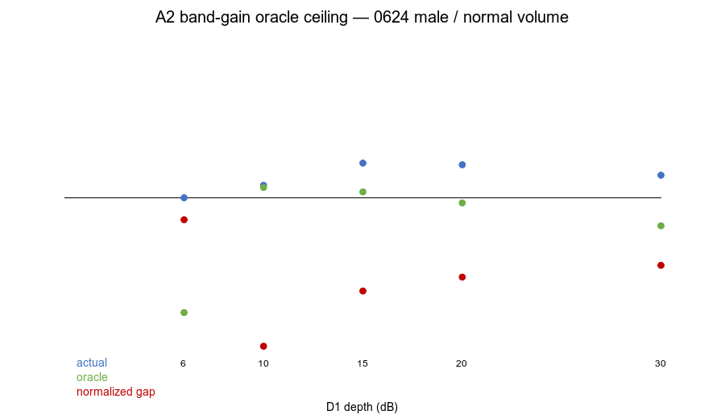

# T13 A2 · G3a′ 结构天花板与 G4′ 违例归因

> [!warning] A3 评测参照订正
> 本报告保留 A2 当时的原始观测，不覆盖历史结果；其中 A2-0/1/2 使用了
> `apply_d1` 的往返前频谱作为 S 参照，已由 A3 证明不自洽。头条结论
> “d20 oracle=0.48342，因此 0.5 可达”作废。修正后的数字与结论见
> [`../T13A3/README.md`](../T13A3/README.md)。A2-3 原本就使用往返后参照，继续成立。

## 范围与边界

- 起始 accepted HEAD：`d5c70f698efa4e8635ca92fb75f336a1e91cd954`。
- 本轮只修改测试、runner 与报告；没有修改生产模块、算法参数、门槛或 `KNOWN_FAIL` 注册表。
- A2-0/1/2 为与现有 G3a′ 完全同口径，使用 `0624/FB_FF_TT_VPU_ld_left_ear_down.wav` 的 6 秒片段；A2-3 为完成说话人/佩戴位置归因，使用 `0624/` 全部 10 条录音的同长度片段。
- 未读取任何 `0625/` 语音条目；本轮也不需要读取 0625 底噪文件。
- **BOUNDARY：0624/0625 共 4 位说话人均为男声（F0 中位 87–124 Hz），且均为正常音量；本报告的一切数据结论只在此边界内成立，不得外推。**

## 结论先行

1. **A2-0：`n_sup≥30` 后，d0/d3/d6/d10 均为 INSUFFICIENT；只有 d15/d20/d30 有资格参与判定。** G3a′ 仍 FAIL，因为 `depth≤20` 的充分样本只有 d15/d20，其 ratio 为 `0.61334/0.60796`，均未达到 `≤0.5`。
2. **A2-1：`sup_dB>6` 的集合确实极稀疏。** 即使 d30 也只占 `3.22%`；d15/d20 分别为 `1.31%/2.22%`。当前 6 dB 门限来自逐谐波语境，缺少带级分布依据；本轮只提供证据，不修改门限。
3. **A2-2：`0.5` 对当前“存在一个 depth≤20”的门槛并非整体不可达。** d15 oracle ratio=`0.51930`，该 depth 结构上不可达；但 d20 oracle=`0.48342<0.5`，说明现有存在量词可由 d20 达成。算法 d20 实测 `0.60796`，归一化差距为 `0.24109`，因此至少在 d20 上仍存在真实算法差距，不能把 G3a′ 全部归因于带级结构。
4. **A2-3：G4′ 与 J2 相关但不等价。** 74.56% 的 J2 点同时是 G4′ 违例，但 J2 只覆盖 1.44% 的 G4′ 违例，Jaccard 仅 1.43%。J2 的 `|corr|>3 dB` 只看见尾部，绝大多数 G4′ 损伤来自小于 3 dB 的持续错误介入。
5. **500–800 Hz 确为重灾区，但不是唯一最高违例率。** 该带违例率 `34.27%`、中位 `w=0.0864`（六带最高）、最大超量 `7.0555 dB`（全局最高）；315–500 Hz 的违例率略高，为 `34.58%`。融合最活跃的核心带也确实是最容易造成 G4′ 损伤的区域。

## A2-0 · 样本充分性守卫

固定规则：`n_sup<30` 的 depth 标为 `INSUFFICIENT`，既不能满足存在量词，也不记作该 depth 的效果失败。

| depth | n_sup | 状态 | 实测 ratio | G3a′ 判定资格 |
|---:|---:|---|---:|---|
| 0 | 0 | INSUFFICIENT | 0.00000（空集） | 无 |
| 3 | 0 | INSUFFICIENT | 0.00000（空集） | 无 |
| 6 | 1 | INSUFFICIENT | 0.50008 | 无 |
| 10 | 14 | INSUFFICIENT | 0.54098 | 无 |
| 15 | 47 | ELIGIBLE | 0.61334 | 有 |
| 20 | 80 | ELIGIBLE | 0.60796 | 有 |
| 30 | 116 | ELIGIBLE | 0.57382 | 有，但不满足 `depth≤20` 的存在域 |

mutation：将最低样本量从 30 改回 1，d6/d10 会重新进入候选集合。充分性元测试立即失败：`A2-0 adequacy: depth 6 entered with n_sup=1<30`。修改位置为 `G3A_MIN_SAMPLES=30 → 1`；没有依赖 d6 的 ratio 是否因舍入落在 0.5 内。

## A2-1 · `sup_dB` 分布

统计单位为等权 `(band, frame)`，每个 depth 共 3600 点。门限仍保持 1/6 dB，不在本轮调整。

| depth | p50 | p75 | p90 | p95 | max | >1 dB | >3 dB | >6 dB | >10 dB |
|---:|---:|---:|---:|---:|---:|---:|---:|---:|---:|
| 0 | 0.00 | 0.00 | 0.00 | 0.00 | 1.35 | 0.03% | 0.00% | 0.00% | 0.00% |
| 3 | 0.00 | 0.00 | 0.00 | 0.04 | 3.44 | 0.53% | 0.06% | 0.00% | 0.00% |
| 6 | 0.00 | 0.00 | 0.23 | 0.50 | 6.44 | 2.42% | 0.42% | 0.03% | 0.00% |
| 10 | 0.00 | 0.22 | 0.88 | 1.52 | 10.44 | 8.56% | 1.50% | 0.39% | 0.03% |
| 15 | 0.00 | 0.47 | 1.51 | 2.53 | 15.44 | 15.06% | 4.00% | 1.31% | 0.47% |
| 20 | 0.00 | 0.58 | 1.89 | 3.25 | 20.44 | 17.92% | 5.53% | 2.22% | 1.03% |
| 30 | 0.00 | 0.63 | 2.07 | 3.91 | 30.44 | 19.03% | 6.78% | 3.22% | 1.64% |

直方图：（可复现 SVG 同目录保留）

## A2-2 · oracle 带级增益天花板

对每个 `P={sup_dB>6}` 点，使用评测侧 X 计算：

```text
g*[b,t] = mean_k(log|X[k,t]| - log|S[k,t]|)
LSD_oracle = RMS_k(log|S| + g* - log|X|)
```

X 只存在于测试路径；生产路径的静态禁入检查继续运行。

| depth | n_sup | 状态 | 实测 ratio | oracle ratio | `(实测−oracle)/(1−oracle)` |
|---:|---:|---|---:|---:|---:|
| 0 | 0 | INSUFFICIENT | 0.00000 | 0.00000 | N/A |
| 3 | 0 | INSUFFICIENT | 0.00000 | 0.00000 | N/A |
| 6 | 1 | INSUFFICIENT | 0.50008 | 0.12520 | 0.42854 |
| 10 | 14 | INSUFFICIENT | 0.54098 | 0.53384 | 0.01532 |
| 15 | 47 | ELIGIBLE | 0.61334 | **0.51930** | 0.19563 |
| 20 | 80 | ELIGIBLE | 0.60796 | **0.48342** | 0.24109 |
| 30 | 116 | ELIGIBLE | 0.57382 | 0.40855 | 0.27944 |

（可复现 SVG 同目录保留）

解释边界：oracle 是“每个子带每帧一个均匀 dB 偏移”的最优值，不是可部署算法。d20 的 oracle 证明 0.5 在当前存在量词下可达；实际算法与 oracle 的差距说明 `w/c_V/MSC` 等决策仍未实现这一最优带级偏移。但 d15 的 oracle 已高于 0.5，不能要求每个 depth 都满足该门槛。

## A2-3 · G4′ 违例归因

本节使用全部 10 条 0624 录音、七个 depth。`w` 直接读取真实 `FusionCore.w_history`；`corr` 从实际输出 `20log|Y|−20log|S|` 计算，与 J2/KR0 口径一致，不使用手工重建的替代环路。

### 按 depth

| depth | U 点数 | G4′ 违例 | 违例率 | J2 点数 |
|---:|---:|---:|---:|---:|
| 0 | 35999 | 8437 | 23.44% | 129 |
| 3 | 35962 | 8331 | 23.17% | 140 |
| 6 | 35398 | 7808 | 22.06% | 150 |
| 10 | 32194 | 6915 | 21.48% | 161 |
| 15 | 29715 | 6426 | 21.63% | 146 |
| 20 | 28901 | 6226 | 21.54% | 129 |
| 30 | 28454 | 6100 | 21.44% | 116 |

G4′ 并非仅在低 depth 失败；违例率在所有 depth 都约 21–23%。

### 按子带

| 子带 Hz | U 点数 | G4′ 违例 | 违例率 | J2 点数 |
|---|---:|---:|---:|---:|
| 100–200 | 40819 | 9843 | 24.11% | 72 |
| 200–315 | 40221 | 11633 | 28.92% | 382 |
| 315–500 | 41259 | 14268 | **34.58%** | 445 |
| 500–800 | 40922 | 14026 | **34.27%** | 72 |
| 800–1250 | 32335 | 309 | 0.96% | 0 |
| 1250–2000 | 31067 | 164 | 0.53% | 0 |

### 按说话人/佩戴位置

| 录音 | U 点数 | G4′ 违例 | 违例率 | J2 点数 |
|---|---:|---:|---:|---:|
| ld/down | 22512 | 6627 | 29.44% | 377 |
| ld/mid | 22728 | 7315 | **32.18%** | 246 |
| ld/up | 22825 | 5064 | 22.19% | 159 |
| lrx/down | 22417 | 4603 | 20.53% | 11 |
| lrx/mid | 22365 | 4272 | 19.10% | 0 |
| lrx/up | 22738 | 2443 | **10.74%** | 16 |
| qy/down | 22499 | 4932 | 21.92% | 18 |
| qy/mid_inner | 22867 | 4802 | 21.00% | 39 |
| qy/mid_outer | 22871 | 5570 | 24.35% | 17 |
| qy/up | 22801 | 4615 | 20.24% | 88 |

佩戴/说话人差异明显：最高 ld/mid 32.18%，最低 lrx/up 10.74%。在当前全男声、正常音量数据内都未出现“只由单一说话人驱动”的情况。

### 按时间

| 片段时间 | U 点数 | G4′ 违例 | 违例率 | J2 点数 |
|---|---:|---:|---:|---:|
| 0–1 s | 37693 | 5056 | 13.41% | 0 |
| 1–2 s | 38368 | 10552 | 27.50% | 127 |
| 2–3 s | 37986 | 10504 | 27.65% | 153 |
| 3–4 s | 37563 | 8206 | 21.85% | 58 |
| 4–5 s | 37087 | 9417 | 25.39% | 196 |
| 5–6 s | 37926 | 6508 | 17.16% | 437 |

违例并非集中在开头冷启动；1–3 秒与 4–5 秒更高。J2 尾部则在 5–6 秒最多。

### 违例处的 `w/corr/sup_dB`

全部 50243 个 G4′ 违例的汇总：

| 量 | 中位 | p90 | 最大 |
|---|---:|---:|---:|
| `w` | 0.0712 | 0.1525 | 0.4950 |
| signed `corr` | 0.3781 dB | 1.5004 dB | 6.4005 dB |
| `|corr|` | 0.5983 dB | 1.6622 dB | 6.4005 dB |
| `sup_dB` | 0.0000 dB | 0.0164 dB | 0.9991 dB |
| G4′ 超量 | 0.3333 dB | 1.3621 dB | 7.0555 dB |

- `w>0` 的精确占比为 99.67%，说明绝大多数违例处融合没有彻底关闭。
- signed `corr` 相对“修正 S→X 所需方向”反向的占比为 51.93%，方向近似随机；问题不只是 `w` 大小，也包括 V→S 修正方向缺乏可靠信息。

逐带诊断：

| 子带 Hz | 违例数 | `w` 中位 | `|corr|` 中位 | `|corr|` p90 | `|corr|` 最大 | 超量最大 | corr 反向率 |
|---|---:|---:|---:|---:|---:|---:|---:|
| 100–200 | 9843 | 0.0597 | 0.5681 | 1.4808 | 3.9783 | 5.0884 | 49.41% |
| 200–315 | 11633 | 0.0700 | 0.6113 | 1.9893 | 4.6328 | 4.4799 | 51.13% |
| 315–500 | 14268 | 0.0758 | 0.5198 | 1.5908 | **6.4005** | 6.0951 | 51.82% |
| 500–800 | 14026 | **0.0864** | **0.6946** | 1.6151 | 5.0207 | **7.0555** | 53.16% |
| 800–1250 | 309 | 0.0057 | 0.4942 | 0.9373 | 1.7952 | 1.7069 | 86.08% |
| 1250–2000 | 164 | 0.0000 | 0.4829 | 0.6932 | 0.8997 | 0.3291 | 100.00% |

1250–2000 Hz 的少量违例发生在 `w=0`，因此不是融合权重本身造成；实际 Y/S 仍有约 0.48 dB 中位变化，可能来自舒适噪声与 ISTFT/STFT 往返。此处只做归因，不改机制。

### 与 J2 的集合重合

沿用现有 J2 定义：mean-log 未被压制超过 6 dB，且实际 `mean|corr|>3 dB`。

| 集合量 | 数值 |
|---|---:|
| G4′ 违例数 | 50243 |
| J2 虚假介入数 | 971 |
| 交集 | 724 |
| G4′ 被 J2 覆盖 | **1.44%** |
| J2 被 G4′ 覆盖 | **74.56%** |
| Jaccard | **1.43%** |

结论：J2 确实多半对应真实 G4′ 损伤，所以“无害边际”的悬置理由不足；但 J2 不是 G4′ 的充分代理，它因 3 dB 阈值漏掉了 98.56% 的 G4′ 违例。按任务要求，本轮不改 `KNOWN_FAIL`，由调度方据此决定撤销或重写 J2 的悬置理由。

## 妥协、风险与反驳

- `n_sup≥30` 是调度方预先固定的样本充分性规则；本轮没有根据观测继续调整。它只解决极小集合参与存在量词，不证明 30 本身具有统计置信度意义。
- A2-1/2 沿用现有 G3a′ 的单条默认录音，是为了保持严格同口径；oracle 是否跨说话人稳定仍未验证。A2-3 扩展到全部 10 条，只用于 G4/J2 归因。
- oracle 结果是混合结论：d15 结构不可达，d20 可达。不能据此把门槛整体撤销，也不能据此要求每个 depth 达标。
- `corr` 从实际 Y/S 计算，包含舒适噪声与时频往返；这正好匹配 G4′/J2 的实际输出风险，但不能把全部 corr 都解释为纯粹的 `clip(w·Δlog)`。
- 归因显示 J2 的尾部不是无害，但注册表按任务要求保持不变；没有通过改注册表、门槛或参数让 suite 变绿。
- ER1、归一化检验、A1-1 均未执行。

## 全套 runner

```text
MIC_REC_ROOT=$HOME/Projects/mic_recordings /tmp/t13venv/bin/python fusion/run_t13_tests.py
T13-A SUMMARY: 70/79 passed, 2 failed, 3 xfailed, 0 xpassed, 4 skipped
```

- FAIL：G3a′、G4′，均为既有未登记真失败；没有加入注册表。
- XFAIL：J2、K-a、K-c，注册表与悬置理由本轮未改。
- 新增 A2 五项测试全部 PASS；HR2、G5、BR2、KR0、DR1、M2–M6 继续通过。
- runner 退出码为 1，来自两个未登记 FAIL，属于预期真实状态。
