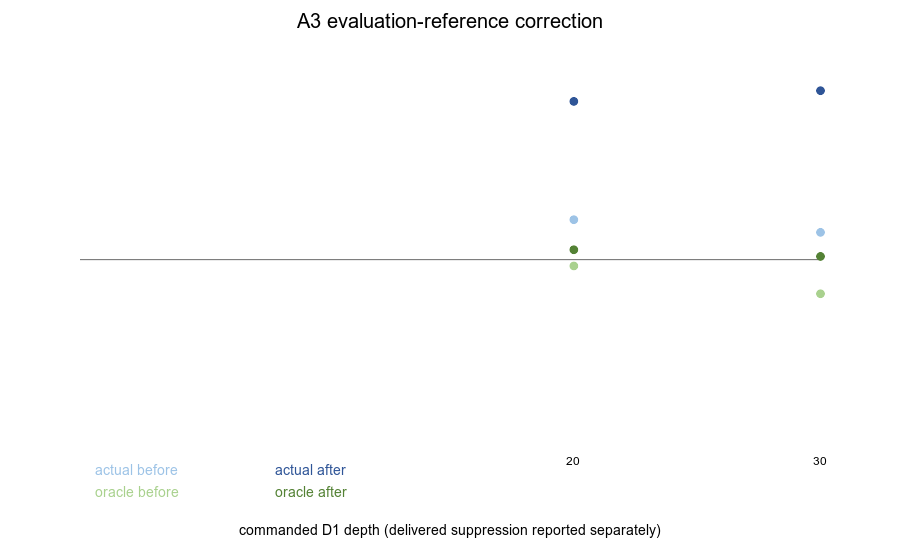

# T13 A3 · 统一时域 S 评测参照

## 范围与边界

- 起始 accepted HEAD：`898013e325058f10637faf7c7d9f7879f21e1441`。
- 本轮只修改测试、runner 与报告；生产模块、算法参数、所有门槛和
  `KNOWN_FAIL` 注册表均未修改。
- 使用 `0624/` 的 10 条录音；未读取 `0625/` 的任何语音条目，也未使用底噪文件。
- **BOUNDARY：数据仅覆盖四名男声说话人（F0 中位 87–124 Hz）和正常音量；所有结论只在该边界内成立，不得外推。**

## 结论先行

1. `apply_d1` 返回的频谱不是算法收到的 S。统一改为
   `spec_S=stft_batch(istft_batch(d1_spec))` 后，恒等算法 `Y:=S` 的 G3a′
   ratio 严格为 1，J1/J3 严格为 0；旧参照会给恒等算法记入
   `G3=0.60793–0.69696`、`J1=0.913–1.000`、`J3=0.627–0.695` 的虚假功劳。
2. A2-2 头条反转。修正后 d20 的 oracle 从 `0.48342` 变为 `0.52706`，
   因而单条默认录音在 `depth≤20` 内没有一个充分样本 depth 的 oracle
   达到 0.5。实际 ratio d20 从 `0.60796` 变为 `0.92640`，norm gap 从
   `0.24109` 变为 `0.84437`。
3. J1 从 d10–30 的 `0.924–1.000` 变为全 0，J3 从 `0.639–0.708`
   变为 `0.014–0.039`，两条原 PASS 均成为未登记真 FAIL。J2 则从尾部
   `0.106/0.142` 降到约 `0.004–0.005`，成为 XPASS；按任务要求没有改注册表。
4. 跨 10 条录音后，oracle d20 中位为 `0.49823`、标准差 `0.02895`，
   `<0.5` 占 60%。0.5 位于录音间分布中央，单条录音的“可达/不可达”
   没有稳健意义。

## A3-0 · 单一评测参照与静态防线

共享 helper `tests/_t13_eval.py::eval_specs` 只允许 D1 原谱生成时域 S，
随后重新 STFT 得到唯一评测参照。B1/A2 中原先直接使用 D1 原谱的七类
评测路径（G3a′、HR4、JR1、JR2、KR0、KR0 mutation、LR4）均改用该入口；
G4′ 也通过 `_d1_only` 间接使用同一入口。

静态检查扫描全部 `tests/test_*.py` 与共享 helper：D1 第一返回值不得进入
`.abs()`/`log10()` 评测；共享 helper 内更严格地只准直接送入 `istft_batch`。
`test_t13_real.py` 中 D1 原谱仍可作为 BR2 的机制刺激和 kill-mask 真值生成链，
但不能作为 Y/S 效果评测参照。

mutation 在 `A3-0-mutant.py:7` 加入：

```text
wrong = 20 * torch.log10(pre.abs())
```

静态断言立即失败，失败值为：

```text
D1 往返前谱 pre 流入 log/abs 评测或绕过 ISTFT
```

## A3-1 · MR1 度量零信息对照

### 正确参照

| commanded depth | n_sup | G3a′ `Y=S` | J1 `Y=S` | J3 `Y=S` |
|---:|---:|---:|---:|---:|
| 15 | 20 | 1.00000000 | 0.00000000 | 0.00000000 |
| 20 | 50 | 1.00000000 | 0.00000000 | 0.00000000 |
| 30 | 95 | 1.00000000 | 0.00000000 | 0.00000000 |

### mutation：参照换回 D1 原谱

| commanded depth | n_sup | 被误记 G3a′ | 被误记 J1 | 被误记 J3 |
|---:|---:|---:|---:|---:|
| 15 | 47 | 0.69696 | 1.000 | 0.695 |
| 20 | 80 | 0.66321 | 0.913 | 0.627 |
| 30 | 116 | 0.60793 | 0.981 | 0.641 |

因此 MR1 会同时在 G3a′、J1、J3 上失败；错误数值直接写入 mutation 输出，
不是只检查代码字符串。

## A3-2 · 修正前后对照

### G3a′、带级 oracle 与归一化差距

`depth` 是下达的 D1 kill depth；送达量不再把该命令值当作实际压制，
而由 `sup_dB` 的分位数和 `n_sup` 表示。

| cmd dB | n_sup 前→后 | actual 前→后 | oracle 前→后 | norm gap 前→后 | 送达 p50/p95/max dB |
|---:|---:|---:|---:|---:|---:|
| 0 | 0→0 | N/A | N/A | N/A | -0.00 / 0.01 / 0.68 |
| 3 | 0→0 | N/A | N/A | N/A | -0.00 / 0.10 / 2.04 |
| 6 | 1→0 | 0.50008→N/A | 0.12520→N/A | 0.42854→N/A | 0.00 / 0.56 / 3.52 |
| 10 | 14→2 | 0.54098→0.87077 | 0.53384→0.59748 | 0.01532→0.67894 | 0.00 / 1.52 / 6.34 |
| 15 | 47→20 | 0.61334→0.87240 | 0.51930→0.50706 | 0.19563→0.74114 | 0.00 / 2.59 / 10.29 |
| 20 | 80→50 | 0.60796→0.92640 | **0.48342→0.52706** | 0.24109→0.84437 | 0.01 / 3.49 / 13.54 |
| 30 | 116→95 | 0.57382→0.95528 | 0.40855→0.50903 | 0.27944→0.90892 | 0.01 / 4.18 / 16.58 |

（可复现 SVG 同目录保留）

### `sup_dB` 分布：下达量与送达量

下表保留 A2 的往返前数值，并并列往返后真实送达数值；每格为“前→后”。

| cmd | p50 | p95 | max | `>6 dB` 占比 |
|---:|---:|---:|---:|---:|
| 0 | 0.00→-0.00 | 0.00→0.01 | 1.35→0.68 | 0.00%→0.00% |
| 3 | 0.00→-0.00 | 0.04→0.10 | 3.44→2.04 | 0.00%→0.00% |
| 6 | 0.00→0.00 | 0.50→0.56 | 6.44→3.52 | 0.03%→0.00% |
| 10 | 0.00→0.00 | 1.52→1.52 | 10.44→6.34 | 0.39%→0.06% |
| 15 | 0.00→0.00 | 2.53→2.59 | 15.44→10.29 | 1.31%→0.56% |
| 20 | 0.00→0.01 | 3.25→3.49 | 20.44→13.54 | 2.22%→1.39% |
| 30 | 0.00→0.01 | 3.91→4.18 | 30.44→16.58 | 3.22%→2.64% |

修正后的完整 p50/p75/p90/p95/max 与 `>1/>3/>6/>10 dB` 分布由
`test_A21_sup_distribution_report` 输出。A2 的历史 SVG/PNG 保留原状，避免
覆盖旧观测；本报告用上表记录修正后的分布。

### J1/J2/J3

| depth | J1 前→后 | J2 前→后 | J3 前→后 | mean-log suppressed n 前→后 |
|---:|---:|---:|---:|---:|
| 0 | 0→0 | 0.098→0.004 | 0→0 | 0→0 |
| 3 | 0→0 | 0.082→0.004 | 0→0 | 0→0 |
| 6 | 0→0 | 0.070→0.004 | 0→0 | 0→0 |
| 10 | 1.000→0 | 0.065→0.005 | 0.659→0.014 | 1→1 |
| 15 | 1.000→0 | 0.106→0.004 | 0.708→0.039 | 18→8 |
| 20 | 0.924→0 | 0.142→0.004 | 0.639→0.025 | 172→74 |
| 30 | 0.980→0 | 0.080→0.005 | 0.648→0.029 | 539→276 |

这不是“算法完全没有逐 bin 变化”：正确参照下 `corr` 存在，但没有任何
受压 band-frame 达到 J1 的 `>3 dB` 介入门槛，能量恢复只剩 1.4–3.9%。

### KR0

KR0 的 0.1 dB 容差未修改。正确参照下主不变量继续零违反；平均 LSD
改善不再包含往返功劳：

| depth | 选择点 n 前→后 | 平均改善 dB 前→后 | KR0 违反前→后 |
|---:|---:|---:|---:|
| 10 | 1→1 | 5.156→0.014 | 0→0 |
| 15 | 18→8 | 4.100→0.255 | 0→0 |
| 20 | 172→74 | 3.977→0.188 | 0→0 |
| 30 | 539→276 | 6.415→0.302 | 0→0 |

修正后旧 `0.1×corr` mutation 因真实改善显著变小而失去牙齿；将 mutation
改为完全断开 corr 报告路径（`corr≡0`），并改成与主测试相同的逐子带选择集。
未修改 0.1 dB 门槛。断言重新失败并被捕获：

```text
KR0 mutation (corr path disconnected, factor 0.1→0):
inequality violated? FAIL-of-mutant (caught) PASS
```

## A3-3 · 0624 全十条 oracle 稳健性

只纳入 `n_sup≥30` 的录音/depth，避免小样本集合参与统计。

| depth | eligible 录音数 | min | median | max | std | `<0.5` 占比 |
|---:|---:|---:|---:|---:|---:|---:|
| 15 | 4 | 0.49619 | 0.52987 | 0.55221 | 0.02089 | 25% |
| 20 | 10 | 0.46430 | 0.49823 | 0.54715 | 0.02895 | 60% |
| 30 | 10 | 0.42668 | 0.47921 | 0.50903 | 0.03017 | 80% |

独立结论：0.5 与 d20 oracle 中位数仅差 0.00177，远小于录音间标准差
0.02895。单条默认录音的二元“可达/不可达”结论不稳健，G3a′ 判据应由
调度方基于该分布重定；本轮没有自行改门槛。

## 全套 runner

```text
MIC_REC_ROOT=$HOME/Projects/mic_recordings /tmp/t13venv/bin/python fusion/run_t13_tests.py
T13-A SUMMARY: 74/85 passed, 4 failed, 2 xfailed, 1 xpassed, 4 skipped
```

- FAIL：G3a′、G4′（既有真失败），以及本轮暴露的 J1、J3。
- XFAIL：K-a、K-c。
- XPASS：J2。注册表保持原样，因此 runner 正确把它作为待处理事件而非普通 PASS。
- G5、HR2、BR2、DR1、MR1、KR0 主不变量及 mutation 均继续有牙。
- runner 退出码为 1；这是当前门槛状态的真实反映，不是执行阻塞。

## 妥协、风险与反驳

- 本轮没有反驳预设判据；所有观测前均保持原门槛。新 FAIL/XPASS 未被加入、
  删除或改写 `KNOWN_FAIL`。
- 修正说明了大部分旧“恢复”来自分析往返，但不能把剩余 1.4–3.9% J3
  直接解释为有用听感改善；G4′ 仍显示大量逐点损伤。
- `sup_dB` 的 6 dB 与 G3a′ 的 0.5 是否应重定，均留给调度方；本轮证据
  明确表明两者会使结论高度依赖稀疏集合与录音选择。
- 静态防线针对“D1 原谱进入效果评测”。BR2 的 D1 kill-mask/机制刺激不是
  Y/S 效果参照，因此保留；若未来将其用于恢复或介入度量，静态检查会在
  `.abs()`/`log10()` 路径上失败。
- 未执行 ER1(A1-0b)、归一化检验(A1-1)或任何生产机制调整。
